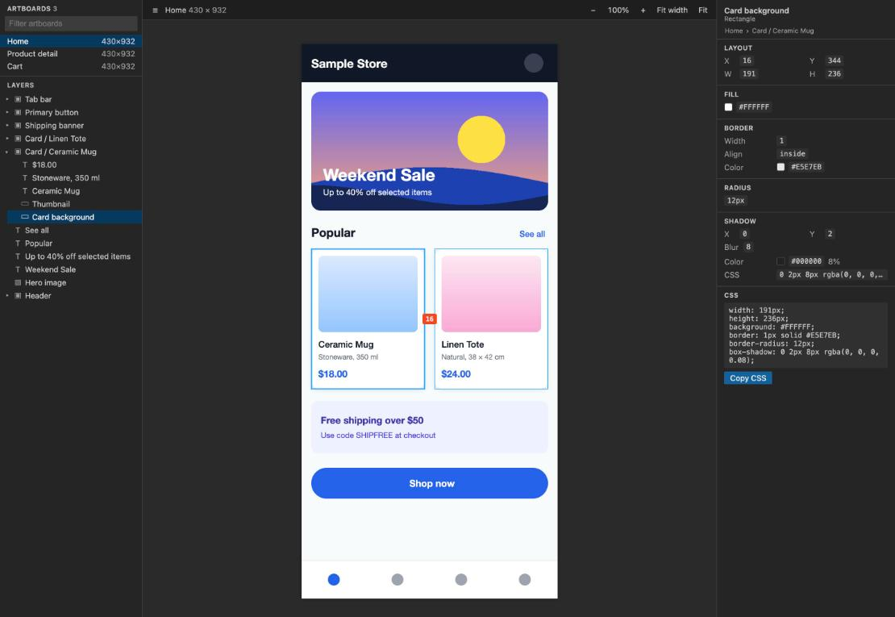
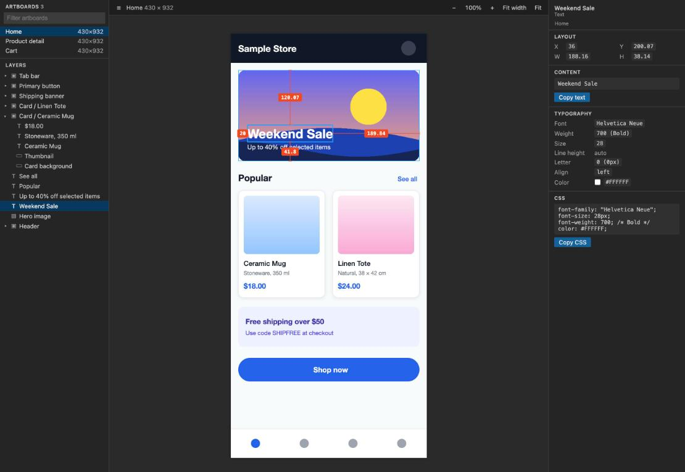

# Design Viewer for XD Files



Open Adobe XD (`.xd`) files in VS Code and inspect them like a developer handoff tool.

- Artboard list with filter, layer tree, zoom/pan canvas
- Click a layer to see position, size, fill, border, radius, shadow, typography and generated CSS; click any value to copy it
- With a layer selected, hover another one (or the artboard background) to see the spacing redlines
- Reloads automatically when the `.xd` file changes on disk
- Fully offline: the file is unzipped and rendered locally, nothing is uploaded



## Install

```bash
pnpm install
pnpm package                       # runs all checks, writes design-viewer-<version>.vsix
code --install-extension design-viewer-0.1.0.vsix
```

## Shortcuts (canvas focused)

| Key | Action |
| --- | --- |
| Scroll / trackpad | Pan |
| Ctrl/Cmd + scroll, pinch | Zoom at the cursor |
| Space + drag, middle drag, drag outside the artboard | Pan |
| `+` / `-` | Zoom in / out |
| `1` | 100% |
| `0` | Fit artboard |
| `W` | Fit width |
| `Esc` | Select the parent layer |

## Limitations

- Text is drawn with the fonts installed locally. Fonts the design uses but this machine lacks are listed as
  "not installed" in the inspector; XD's Windows fallback fonts (Yu Gothic UI) are approximated with proportional
  Japanese metrics.
- Blur and background-blur effects are not rendered (listed under "Not rendered" in the artboard inspector).
- Figma files are not supported.

## Development

```bash
pnpm watch                            # rebuild on change, then F5 in VS Code to launch the extension host
pnpm check                            # type-check, lint, tests, build
pnpm smoke <file.xd>...               # parse and render every artboard, print warnings
pnpm preview <file.xd> <out-dir>      # static browser copy of the webview for UI checks
pnpm sample <out.xd>                  # write an original demo design (used for the screenshots above)
```

`pnpm preview` writes the design data to `<out-dir>`; keep it outside the repository.

## Trademarks

Adobe XD is a trademark of Adobe Inc. This project is an independent viewer for `.xd` files and is not affiliated
with, sponsored or endorsed by Adobe. The icon is original artwork.
