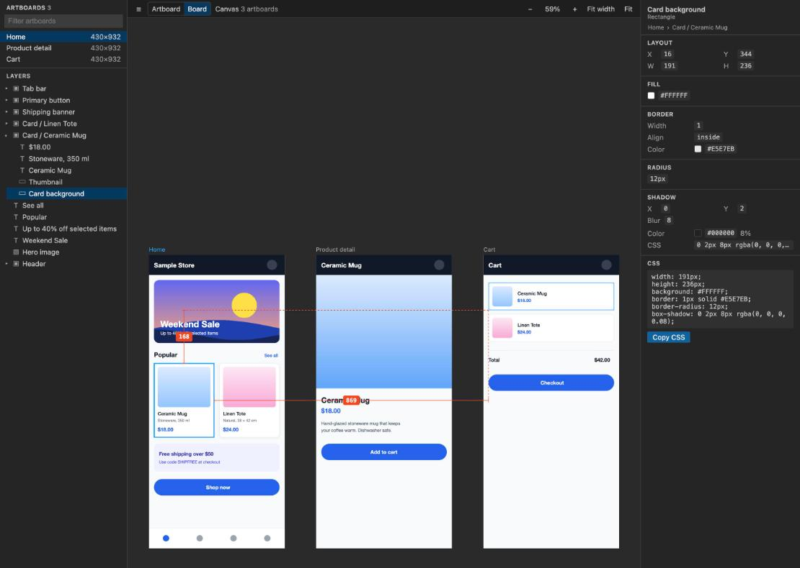

# Artboard Inspector


Open Adobe XD (`.xd`) files and Figma local copies (`.fig`) in VS Code and inspect them like a developer handoff tool.

- Artboard list with filter, layer tree, zoom/pan canvas
- Click a layer to see position, size, fill, border, radius, shadow, typography and generated CSS; click any value to copy it
- With a layer selected, hover another one (or the artboard background) to see the spacing redlines
- Board view: every artboard at its position in the file, inspect and measure across artboards
- Reloads automatically when the file changes on disk
- Fully offline: the file is unzipped and rendered locally, nothing is uploaded


## Board view

Switch the toolbar from **Artboard** to **Board** (or press `B`) to see every artboard of the file where the
designer placed it — one board per Figma page (pick it in the toolbar), one board for an XD file. Click any layer
on any artboard to inspect it, hover another layer or artboard to measure the distance (also between artboards),
and double-click an artboard or its title to open it on its own. Clicking an artboard in the list flies to it.
Only artboards near the screen and large enough to read are drawn in full, so files with hundreds of artboards stay
responsive.



## Figma files (.fig)

In Figma choose **File → Save local copy…** and open the downloaded `.fig` file in VS Code. Every top-level frame
(also frames inside sections) becomes an artboard, listed as `Page / Section / Frame`. The file is decoded and drawn
locally — no Figma account, token or network access is needed.

## Build from source

Requires Node.js 22.18 or later (the tests and scripts run TypeScript directly) and pnpm 10.

```bash
corepack enable                    # provides the pnpm version pinned in package.json
pnpm install
pnpm package                       # runs all checks, writes artboard-inspector-<version>.vsix
code --install-extension artboard-inspector-0.2.0.vsix
```

## Shortcuts (canvas focused)

| Key | Action |
| --- | --- |
| Scroll / trackpad | Pan |
| Ctrl/Cmd + scroll, pinch | Zoom at the cursor |
| Space + drag, middle drag, drag outside the artboard | Pan |
| `B` | Switch between Artboard and Board view |
| `+` / `-` | Zoom in / out |
| `1` | 100% |
| `0` | Fit artboard (Board: fit the whole board) |
| `W` | Fit width |
| `Esc` | Select the parent layer (Board: then the artboard, then nothing) |
| Double-click (Board) | Open that artboard on its own |

## Limitations

- Text is drawn with the fonts installed locally. Fonts the design uses but this machine lacks are listed as
  "not installed" in the inspector; XD's Windows fallback fonts (Yu Gothic UI) are approximated with proportional
  Japanese metrics.
- Files larger than 300 MB, or with more than 50,000 layers per artboard, are refused or cut off (with a notice) to
  keep VS Code responsive.
- Blur and background-blur effects are not rendered (listed under "Not rendered" in the artboard inspector).
- Figma: layers are redrawn from the file, so they can differ slightly from Figma itself. Layers with several fills
  show only the top one, angular/diamond gradients are drawn as radial ones, and FigJam objects (stickies, widgets)
  are listed as unsupported. Only `.fig` local copies are read — Figma links are not.

## Development

```bash
pnpm watch                            # rebuild on change, then F5 in VS Code to launch the extension host
pnpm check                            # type-check, lint, fast tests (node:test + happy-dom), build
pnpm coverage                         # fast tests with Node's built-in coverage report
pnpm test:e2e                         # Playwright in the installed Google Chrome against the browser preview
pnpm test:vscode                      # extension tests inside VS Code (uses the installed app if found)
pnpm smoke <file.xd|file.fig>...     # parse and render every artboard, print warnings
pnpm preview <file.xd|file.fig> <dir> # static browser copy of the webview for UI checks
pnpm sample <out.xd>                  # write an original demo design (used for the screenshots above)
```

- `pnpm test:e2e` checks the synthetic demo (selection, inspector values, redlines, zoom, board view, images
  actually decoded, no console/CSP errors). To run the generic checks on your own files as well, list them in
  `E2E_FILES`, separated by `:` — e.g. `E2E_FILES="$HOME/a.xd:$HOME/b.fig" pnpm test:e2e`. It needs Google Chrome;
  no Playwright browser download is required.
- `pnpm test:vscode` opens the demo `.xd` and a small synthetic `.fig` in a real VS Code and checks that the
  Artboard Inspector editors open them by default. Set `VSCODE_EXECUTABLE` to use a specific VS Code build;
  without it and without `/Applications/Visual Studio Code.app`, a copy of VS Code is downloaded.
- `pnpm preview` writes the design data to `<dir>`, and `E2E_FILES` runs build previews in a temporary folder;
  keep real designs out of the repository.

## Trademarks

Adobe XD is a trademark of Adobe Inc. Figma is a trademark of Figma, Inc. This project is an independent viewer for
`.xd` and `.fig` files and is not affiliated with, sponsored or endorsed by Adobe or Figma. The icon is original
artwork.
